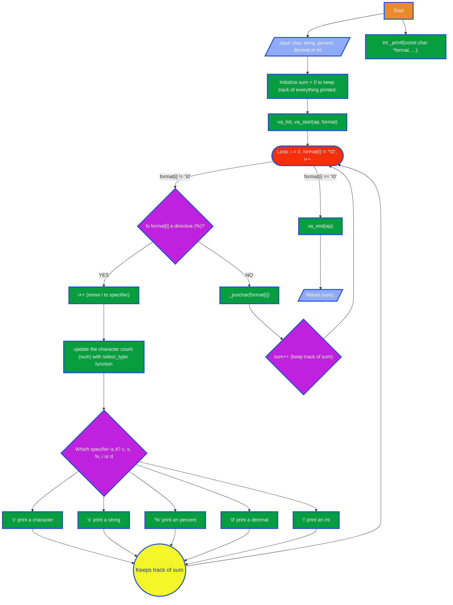

holbertonschool-printf

# Recreating the printf function:
    This project consists of recreating the C standard library function `printf`. The goal is to understand how formatted output works internally by handling various format specifiers, managing variable arguments, and producing output exactly like the original function. Through this project, we explore low-level programming concepts such as buffers, variadic functions, and string manipulation.

# Project Goals:
	Our function is designed to produce output according to a specified format string, writing to stdout. The current implementation handles the following mandatory conversion specifiers:
		%c  Prints a single character.
		%s  Prints a string of characters.
		%d  Prints a signed decimal integer.
		%i  Prints a signed integer.
		%%  Prints a percent sign.

<!-- Exemple d'utilisation -->
Usage:
	The function prototype is:
		int _printf(const char *format, ...);
		It returns the number of characters printed (excluding the null byte).

<!-- Requierements + environement de  travail-->
Design and Structure:
	For this project we used git and gcc on Ubuntu 20.04 LTS, it also follows a design to adhere to the Betty style guide.

Core Files:
	main.h: Contains all function prototypes and the definition of the fmt_t structure.
	man_3_printf: The manual page for the _printf function.

<!-- Compilation command -->
##
Compilation:
	The code is compiled on Ubuntu 20.04 LTS using gcc with the following flags:
		gcc -Wall -Werror -Wextra -pedantic -std=gnu89 -Wno-format *.c

<!-- Exemple de tests avec resultats attendus + valgreed + valleur de retour -->

## Man page
The dedicated `man_3_printf` page will be added once every mandatory conversion is implemented

# Flowchart of the _printf Function
The following flowchart illustrates the main logic loop of the function, from the start to the processing of the characters and format specifiers.

