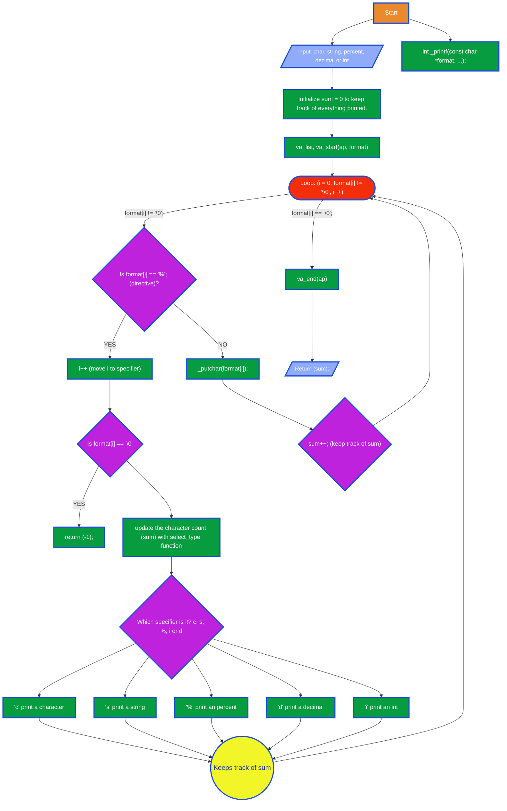

holbertonschool-printf

# C - Custom printf Implementation

## Project Overview
    This project consists of recreating the C standard library function `printf`. The goal is to understand how formatted output works internally by handling various format specifiers, managing variable arguments, and producing output exactly like the original function. Through this project, we explore low-level programming concepts such as buffers, variadic functions, and string manipulation.

This project involves the collaborative creation of a custom function, _printf, that mimics the functionality of the standard C library's printf function. This deep dive focuses on mastering concepts such as variadic functions, formatted output generation, and using the write system call for low-level character output.

The goal is to handle the basic set of format specifiers and provide accurate output, along with returning the correct number of characters printed.

## Functionality

The _printf function is declared as follows:

```bash
int _printf(const char *format, ...);
```

## Supported Format Specifiers
`_printf(const char *format, ...)` writes to `stdout` and returns the number of characters printed, just like the libc implementation. The mandatory specifiers currently supported are:

| Specifier | Behavior | Helper |
| --- | --- | --- |
| `%c` | Prints a single character (`int`). | `print_char` in `print_helpers.c` |
| `%s` | Prints a string. `NULL` prints `(null)`. | `print_string` |
| `%d` / `%i` | Prints a signed decimal integer. | `print_int` / `print_int_helper` |
| `%%` | Prints `%`. | `print_percent` |

The dispatching logic lives in `select_type` (inside `_printf.c`) and relies on the `specifier_t` structure defined in `main.h`.

## Design Flow

1. `_printf` walks the `format` string one character at a time.
2. When `%` is encountered, it calls `select_type` to retrieve the correct helper function.
3. The helper pulls the argument with `va_arg`, renders it as text, and pushes each character to `_putchar`.
4. `_printf` accumulates the returned character counts so it can return the final number to the caller.

This split keeps parsing in `_printf.c` and rendering in `print_helpers.c`, which makes adding new specifiers (`%b`, `%u`, `%o`, etc.) straightforward.

# Installation and Usage

## Prerequisites

- A C compiler (e.g., GCC).

- A UNIX-like environment (Linux, macOS, WSL).

## Compilation

To compile the `_printf project`, ensure you have all the necessary source files (`_printf.c`, `print_helpers.c`, and `main.h`) in the same directory. 
Compile everything with `gcc` using the standard Holberton flags:

```bash
gcc -Wall -Wextra -Werror -pedantic -std=gnu89 -Wno-format *.c
```

Run Betty on the entire code base when needed:

```bash
betty *.c *.h
```

## Example Usage
	The function prototype is:
		int _printf(const char *format, ...);
		It returns the number of characters printed (excluding the null byte).

`main.c` demonstrates how `_printf` mirrors `printf` and returns the exact same character count:

```c
#include "main.h"

int main(void)
{
    int len = _printf("Length:[%d, %i]\n", 42, -42);
    int len2 = printf("Length:[%d, %i]\n", 42, -42);

    _printf("%%c: %c | %%s: %s | %%d: %d\n", 'H', "Holberton", len);
    printf("Both calls printed %d and %d chars\n", len, len2);

    return (0);
}
```

Expected output:

```
Length:[42, -42]
Length:[42, -42]
%c: H | %s: Holberton | %d: 42
Both calls printed 42 and 42 chars
```
To compile your test file with the custom library:
```bash
gcc -Wall -Werror -Wextra -pedantic -std=gnu89 main.c -L. -lholberton -o test_app
./test_app
```

## Files

| File | Description |
| --- | --- |
| `main.h` | Public prototypes, definition of `specifier_t`, signatures for every helper. |
| `_printf.c` | Implementation of `_printf` and the dispatcher. |
| `print_helpers.c` | All helper functions dedicated to each format specifier. |
| `_putchar.c` | Low-level write wrapper around `write(2)`. |
| `main.c` | Simple demo program comparing `_printf` to `printf`. |
| `test/0-main.c` | Additional tests aligned with the Holberton checker. |


## Man Page
The dedicated `man_3_printf` page will be added once every mandatory conversion is implemented

## Test
- **Side-by-side comparison with `printf`**: `main.c` and `test/0-main.c` print identical strings through both functions and compare their return values.
- **Valgrind (optional)**:

  ```bash
  valgrind --leak-check=full ./a.out
  ```

- **Return value checks**: `_printf` should return `-1` whenever a specifier is unknown and otherwise return the exact number of printed characters. Extend the scenarios under `test/` to cover empty strings, `NULL`, very large/small integers, etc.

# Flowchart of the _printf Function
The following flowchart illustrates the main logic loop of the function, from the start to the processing of the characters and format specifiers.


## Next Steps

- Implement the advanced specifiers (`%b`, `%u`, `%o`, `%x`, pointers, etc.).
- Expand the cases inside `test/` (long strings, `INT_MIN`/`INT_MAX`, missing arguments).
- Finish the manual page and a flow diagram that illustrates the internal architecture.

